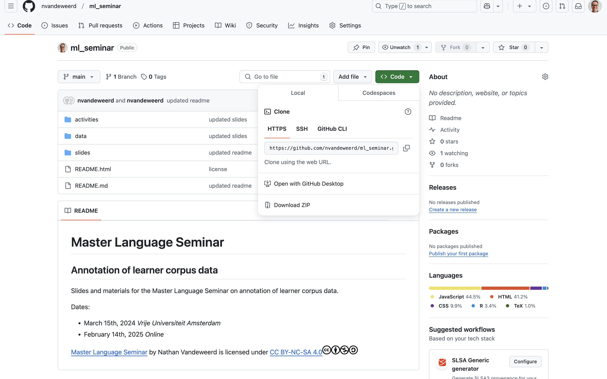
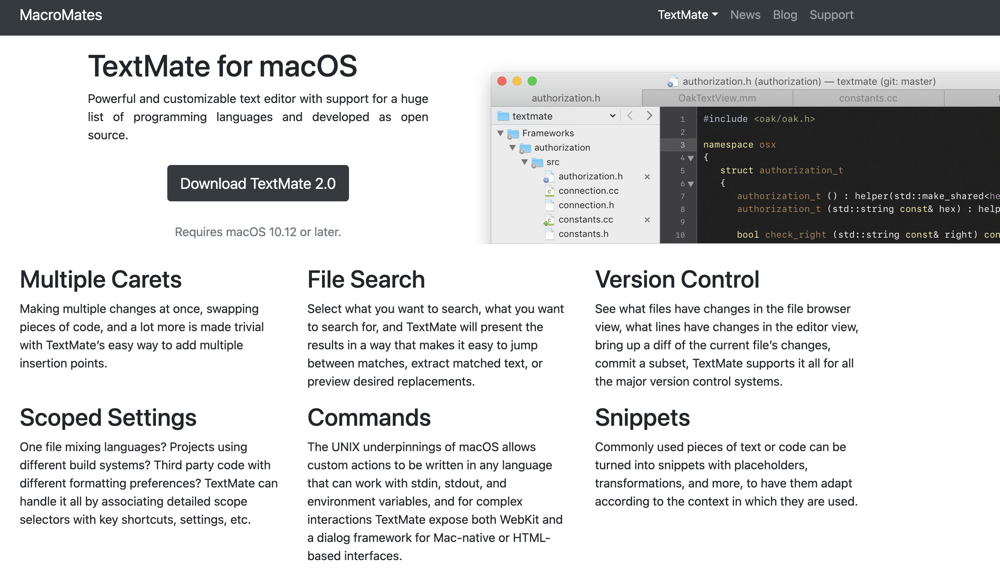

```{r setup, include=FALSE}
options(htmltools.dir.version = FALSE)
knitr::opts_chunk$set(echo = FALSE, warning = FALSE, error = FALSE, 
                      message = FALSE, fig.align = "center")
library(officedown); library(officer)
library(tidyverse)
library(here);
library(kableExtra)

def_text <- fp_text(font.size = 12, font.family = "Open Sans")

# set_flextable_defaults(font.family = "Montserrat", 
#                        font.size = 12,
#                        digits = 0,
#                        border.color = "#000000",
#                        padding.bottom = 1,
#                        padding.top = 1,
#                        padding.left = 3,
#                        padding.right = 1)


```

```{r xaringanExtra, echo=FALSE}
xaringanExtra::use_xaringan_extra(c("tile_view", "editable"))
```

```{r load_refs, include=FALSE, cache=FALSE, eval = TRUE }
library(RefManageR)
BibOptions(check.entries = FALSE,
           bib.style = "authoryear",
           cite.style = "text",
           style = "markdown",
           hyperlink = FALSE,
           dashed = FALSE,
           no.print.fields = c("url", "doi", "issn", "isbn"),
           max.names = 3)
bib <- RefManageR::ReadBib(here("slides", "assets", "references.bib"), check = TRUE)

```

```{r xaringan-banner, echo=FALSE}
xaringanExtra::use_banner(
  bottom_center = paste0("Last updated: ", format(Sys.time()), " | ", "Slides available here: github.com/nvandeweerd/ml_seminar_2024_03_15"),
  exclude = "title-slide"
)
```


## Materials and sides available on [GitHub](github.com/nvandeweerd/lcr_ss_2023)

.pull-left[
```{r}

```

1. Click on .content-box-green[ `< > Code`].
2. [Download ZIP](https://github.com/nvandeweerd/ml_seminar_2024_03_15/archive/refs/heads/main.zip) to download all files.
]

.pull-right[
```{r, out.width="80%"}
knitr::include_graphics("figures/qrcode.png")
```
]


---

class: header-slide

# Introduction


---

## About me

.pull-left[

`r icons::fontawesome("university")` Radboud University Nijmegen  
`r icons::fontawesome("building")` Assistant professor in Language and Communication  
`r icons::fontawesome("search")` Research interests:
  - Phraseological complexity in L2 French
  - Accuracy of automatic transcription software for L2 data
  - Language development during study abroad 
  - Crowdsourcing language assessment (CLAP) 
  - Linguistic characteristics of AI vs. L2-produced text

]

.pull-right[
```{r, out.width="60%", fig.align='center'}
knitr::include_graphics("figures/id-pic-noleaf.png")
```

]

---

## About me

.pull-left[

`r icons::fontawesome("university")` Radboud University Nijmegen  
`r icons::fontawesome("building")` Assistant professor in Language and Communication  
`r icons::fontawesome("search")` What makes me happy:
- Eurovision Songcontest (Go Joost!)
- Baking cookies 
- Cycling
- Reading


]

.pull-right[
```{r, out.width="60%", fig.align='center'}
knitr::include_graphics("figures/id-pic-leaf.png")
```

]


---

<iframe allowfullscreen frameborder="0" height="100%" mozallowfullscreen style="min-width: 500px; min-height: 355px" src="https://app.wooclap.com/events/TBIHYT/questions/65e5e027add92ffa913d95c6" width="100%"></iframe>


---

## Types of automatic annotation

.pull-left[
.large[
1. Part of Speech (POS) tagging
]

]

---


## Types of automatic annotation

.pull-left[
.large[
1. Part of Speech (POS) tagging
]

```{r}

```

.citation[ `r Citep(bib, c("VanRooy2015"), before = "", after = ": 80")`]

]

--

.pull-right[

`r icons::fontawesome("search")` Research topics  

- articles
- morpho-syntactic and syntactic labels
- morphology
- semantic, syntactic and discourse features
- verb valency patterns
- grammatical complexity
- grammatical case
- cohesion and cohesive devices
- stance features
- verb aspect
- adverbs of degree and negation
- verb phrase ellipsis
- formulaic language/phraseology 

]

---

## Types of automatic annotation

.pull-left[
.large[
1. Part of Speech (POS) tagging
]

```{r}

```

.citation[ `r Citep(bib, c("VanRooy2015"), before = "", after = ": 80")`]

]


.pull-right[

`r icons::fontawesome("search")` Research topics  

- .green[articles]
- .green[morpho-syntactic and syntactic labels]
- .green[morphology]
- semantic, syntactic and .green[discourse features]
- .green[verb] valency patterns
- grammatical complexity
- grammatical .green[case]
- cohesion and .green[cohesive devices]
- stance features
- .green[verb aspect]
- .green[adverbs] of degree and negation
- .green[verb] phrase ellipsis
- formulaic language/phraseology 

]

---

## Types of automatic annotation

.pull-left[
.large[
1. Part of Speech (POS) tagging
1. Syntactic parsing
]

]

.pull-right[

`r icons::fontawesome("search")` Research topics  

- .green[articles]
- .green[morpho-syntactic and syntactic labels]
- .green[morphology]
- semantic, syntactic and .green[discourse features]
- .green[verb] valency patterns
- grammatical complexity
- grammatical .green[case]
- cohesion and .green[cohesive devices]
- stance features
- .green[verb aspect]
- .green[adverbs] of degree and negation
- .green[verb] phrase ellipsis
- formulaic language/phraseology 

]


---

## Types of automatic annotation

.pull-left[
.large[
1. Part of Speech (POS) tagging
2. Syntactic parsing
]

```{r}

```

.citation[ `r Citep(bib, c("Newman2021"), before = "", after = ": 32")`]

]


.pull-right[

`r icons::fontawesome("search")` Research topics  

- .green[articles]
- .green[morpho-syntactic and syntactic labels]
- .green[morphology]
- semantic, .purple[syntactic] and .green[discourse features]
- .green[verb] .purple[valency patterns]
- .purple[grammatical complexity]
- grammatical .green[case]
- cohesion and .green[cohesive devices]
- stance features
- .green[verb aspect]
- .green[adverbs] of degree and negation
- .green[verb] .purple[phrase] ellipsis
- .purple[formulaic language/phraseology]

]

---


## Types of automatic annotation

.pull-left[
.large[
1. Part of Speech (POS) tagging
2. Syntactic parsing
3. Semantic annotation
]


]


.pull-right[

`r icons::fontawesome("search")` Research topics  

- .green[articles]
- .green[morpho-syntactic and syntactic labels]
- .green[morphology]
- semantic, .purple[syntactic] and .green[discourse features]
- .green[verb] .purple[valency patterns]
- .purple[grammatical complexity]
- grammatical .green[case]
- cohesion and .green[cohesive devices]
- stance features
- .green[verb aspect]
- .green[adverbs] of degree and negation
- .green[verb] .purple[phrase] ellipsis
- .purple[formulaic language/phraseology]

]

---

## Types of automatic annotation

.pull-left[
.large[
1. Part of Speech (POS) tagging
2. Syntactic parsing
3. Semantic annotation
]

```{r}

```

.citation[ `r Citep(bib, c("Newman2021"), before = "", after = ": 35")`]

]


.pull-right[

`r icons::fontawesome("search")` Research topics  

- .green[articles]
- .green[morpho-syntactic and syntactic labels]
- .green[morphology]
- .orange[semantic], .purple[syntactic] and .green[discourse features]
- .green[verb] .purple[valency patterns]
- .purple[grammatical complexity]
- grammatical .green[case]
- cohesion and .green[cohesive devices]
- .orange[stance features]
- .green[verb aspect]
- .green[adverbs] of degree and negation
- .green[verb] .purple[phrase] ellipsis
- .purple[formulaic language/phraseology]

]

---

## Why use automatic annotation?

--

.pull-left[
```{r, out.width="60%"}

```

]

--

.pull-right[
```{r, out.width="60%"}

```

]


---

## Today's session

- Text-preprocessing
- POS-tagging and lemmatization
- Hands on activity: *POS-tagging and lemmatization*
- Syntactic annotation
- The reliability of automatic tools on learner data

---

class: header-slide

# Text-preprocessing

---

## What do you notice about this text?

.pull-left[

.medium[
```{r, results='asis'}
ex_txt_01 <- scan(here("data", "example_texts", "1638304.txt"), what = character(), sep = "\n") %>%
  paste(., collapse = " ") %>%
  str_replace(., "don't", "don 't") %>%
  str_replace(., "'", "’") %>%
  str_replace(., "news", "&lt;e&gt;news&lt;/e&gt;")
cat(ex_txt_01)
  
```
]

]

.pull-right[
`r icons::fontawesome("exclamation-triangle")` Ignore spelling mistakes for the time being...
]

---

## What do you notice about this text?

.pull-left[

.medium[
```{r, results='asis'}
ex_txt_01 %>%
  str_replace_all(., "(don ’t)", ".content-box-red[\\1]") %>%
  str_replace_all(., "([^, ]+,[^, ]+)", ".content-box-red[\\1]" ) %>%
  str_replace_all(., "(&lt;e&gt;news&lt;/e&gt;)", ".content-box-red[\\1]" ) %>%
  cat()
```
]
]

.pull-right[

(Non-exhaustive) list of things that can cause issues for automatic tools: 

- (Inconsistent) file encoding
- Spacing 
  - Lack of space between words 
  - Unnecessary space between words
  - Double space between words
- 'Stylized' apostrophes or quotation marks
- Accented characters (e.g., *à*)
- Special characters (e.g., *, %, |)
- Inconsistent spelling rules (e.g., email/e-mail)
- Coding schemes (e.g., XML)

]

---

## What do you notice about this text?

.pull-left[

.medium[
```{r, results='asis'}
ex_txt_01 %>%
  str_replace_all(., "(don ’t)", ".content-box-red[\\1]") %>%
  str_replace_all(., "([^, ]+,[^, ]+)", ".content-box-red[\\1]" ) %>%
  str_replace_all(., "(&lt;e&gt;news&lt;/e&gt;)", ".content-box-red[\\1]" ) %>%
  cat()
```
]
]

.pull-right[

(Non-exhaustive) list of things that can cause issues for automatic tools: 

- (Inconsistent) file encoding
- Spacing 
  - Lack of space between words 
  - Unnecessary space between words
  - Double space between words
- 'Stylized' apostrophes or quotation marks
- Accented characters (e.g., *à*)
- Special characters (e.g., *, %, |)
- Inconsistent spelling rules (e.g., email/e-mail)
- Coding schemes (e.g., XML)

.content-box-blue[
`r icons::fontawesome("exclamation-triangle")` Importance of **knowing your corpus**...


]

]

---

## Methods of text cleaning/preprocessing

.center[
`r icons::fontawesome("plus")` Time intensive
`r icons::fontawesome("minus")` Replicable
]

1. Manually
3. Semi-manually using [regular expressions](https://regex101.com/) (e.g., in a text editor)
4. Semi-automatically using a script with regular expressions (e.g., in R or python)

.center[
`r icons::fontawesome("minus")` Time intensive
`r icons::fontawesome("plus")` Replicable
]


---


## Regular expressions (RegEx)

.pull-left[
Special patterns that allow you to search for specific sequences.

*Examples:*  

`\w`: Returns a word character (A-Z, a-z, _)  
`\s`: Returns a space character  
`+`: Returns one or more of the previous character  
`?`: Returns zero or more of the previous character  
`.`: Returns any single character  

See [here](https://regex101.com/) for a website where you can test regular expressions.

]

.pull-right[

```{r, fig.align='center', fig.cap = "" }

```

]

---

## Regular expressions (RegEx)

.pull-left[
Special patterns that allow you to search for specific sequences.

*Examples:*  

`\w`: Returns a word character (A-Z, a-z, _)  
`\s`: Returns a space character  
`+`: Returns one or more of the previous character  
`?`: Returns zero or more of the previous character  
`.`: Returns any single character  

.content-box-blue[
`r icons::fontawesome("home")` Try this at home: What regular expression could be used to remove the 'headers' from the ICLE texts (data/icle_texts)? (e.g., ` <ICLE-BR-FF-0062.1> `). Be careful not to remove anything else! (Answers at the end of the slides).

]

]

.pull-right[
```{r, fig.align='center', fig.cap = "" }

```

]


---

## Notepad++ (PC) / Textmate (Mac)

.pull-left[
.center[
[Notepad + +](https://notepad-plus-plus.org/)]

```{r, fig.align='center', fig.cap = "" }

```

]

.pull-right[
.center[
[Textmate](https://macromates.com/) ]
```{r, fig.align='center', fig.cap = ""}

```

]

---

## Textmate (Mac)

.pull-left[
```{r, fig.align='center', fig.cap = "" }

```

]

.pull-right[
```{r, fig.align='center', fig.cap = "" }

```

]


---


## R

```{r, eval = FALSE, echo = TRUE}
library(stringr); library(dplyr)
```

```{r, echo = TRUE}
text <- "This is a sentence that ’s got a stylized apostrophe."

text %>%
  # replace stylized apostrophes
  str_replace_all("’", "'") %>%
  # remove spaces before apostrophes 
  # if they are:
  # - preceded by the beginning of a string, space or final punctuation
  # - followed by only one or two letters (e.g., don't, they're)
  # - and then followed by either a space, final punctuation or end of string
  str_replace_all("[\\s\\.\\?\\!^]'([^\\s]{1,2}[\\s\\.\\?\\!$])", "'\\1")
```

--

.center[
.content-box-red[
`r icons::fontawesome("exclamation-triangle")` Note that you need double slashes for special or escape characters in R (`\\`).  

]
]

---

## With both approaches

.center[
.content-box-red[
`r icons::fontawesome("exclamation-triangle")` Test (and re-test) your pre-processing pipeline! 
]
]

- Be careful of inadvertent changes (especially when using regular expressions)  
    E.g. *don't* vs. *he said 'don't worry'*  
- Be aware the different tools require different approaches (e.g., contractions separate or apart)
- Never edit the original corpus files!
- Keep track of any changes you make

--

```{r, echo = TRUE}
text <- "'He ’ll be comin' round the 'mountain' when he comes,' I said."

text %>%
  str_replace_all("’", "'") %>%
  str_replace_all("[\\s\\.\\?\\!^]'([^\\s]{1,2}[\\s\\.\\?\\!$])", "'\\1")
```

---

## So why is pre-processing so important?

.pull-left[

```{r, comment=''}

ex_txt_01 %>% 
  str_split(" ", simplify = TRUE) %>%
  as.vector() %>%
  head(30) 

  
```
]

--

.pull-right[
```{r, out.width="60%"}

```

.center[.medium[*Garbage in...garbage out*]]

]

---

## Tokenization

**Token**: "the smallest unit of a corpus" .citation[ `r Citep(bib, c("Krause2012"), before = "", after = ": 2", max.names = 3)`]  
--

  = words, numbers, punctuation marks, quotation marks etc.  
--
  
  = syllable, phoneme, etc...  
--

.pull-left[
Easiest method (for English): 
- split tokens at spaces
- split sentences at periods (.), exclamation marks (!) or question marks (?)

*What problems do you see with this method?*

]

--

.pull-right[
Potential problems:

.medium[
- clitics (isn't, ain't)
- missing whitespace 
- periods (etc., U.S.A., fig.)
- ordinal numbers 
- multiword expressions (New York-based, 10 000, as well as)
- word-internal punctuation (relationship(s), "Rambo"-type)
- (de)hypthenation (preprocessing vs. pre-processing)
- quoted speech (“You still don’t have an accountant?” Ellis said.)
- ideographic languages (e.g., Chinese, Japanese)
]


]

.center[

.content-box-blue[
`r icons::fontawesome("search")` For more information about tokenization see `r Citet(bib, c("Zeldes2020"), before = "", after = "")` and `r Citet(bib, c("Schmid2008"), before = "", after = "")`.  

<br> 
]
]


---

class: header-slide

# POS-tagging and lemmatization


---

## Overview

.pull-left[

.medium[Each word in the corpus is 'tagged' (labelled) with information about its grammatical category.]

`r icons::fontawesome("wrench")` Under the hood: 
1. All tokens with unambiguous POS labels are assigned tags (e.g., on the basis of a dictionary)
2. Contextual features (e.g., surrounding tags, morphological endings) used in a statistical model to predict the tags of ambiguous items 

.citation[ `r Citep(bib, c("Kyle2021"), before = "", after = ": 6")`]

]

--

.pull-right[
.medium[
She `r icons::fontawesome("tag")` `pronoun`  
sells `r icons::fontawesome("tag")` `verb`  
seashells `r icons::fontawesome("tag")` `noun`  
by `r icons::fontawesome("tag")` `preposition`  
the `r icons::fontawesome("tag")` `determiner`  
seashore `r icons::fontawesome("tag")` `noun`  
. `r icons::fontawesome("tag")` `punctuation`  
]
]

---

## Tagsets for English

- CLAWS (Constituent Likelihood Automatic Word-tagging System)
  - [CLAWS 5](http://ucrel.lancs.ac.uk/claws5tags.html) = 60 tags 
  - [CLAWS 7](http://ucrel.lancs.ac.uk/claws7tags.html) = 160 tags
- [PENN Treebank Tagset](https://www.cis.uni-muenchen.de/~schmid/tools/TreeTagger/data/Penn-Treebank-Tagset.pdf)
- [BNC Tagset](http://www.natcorp.ox.ac.uk/docs/c5spec.html) 
- [Universal POS tags](https://universaldependencies.org/u/pos/)

*Different tagsets, (subtly) different theories of grammar*

--

```{r, out.width="40%"}
knitr::include_graphics("figures/rid.png")
```

.center[
.citation[ `r Citep(bib, c("Newman2021"), before = "", after = ": 21")`
 ]]

--


.content-box-blue[
`r icons::fontawesome("lightbulb")` Select the tagset that is right for your data/research question.

]


---

## Example

.pull-left[
```{r}


```

.citation[ `r Citep(bib, c("VanRooy2015"), before = "", after = ": 80-81")`]
]


--

.pull-right[
```{r}
claws_horizontal <- scan(here("data", "example_texts", "ICLE-TS-NOUN-0005.1_horizontal.txt"), what = character(), sep = "\n")

pos_example <- str_split(claws_horizontal, " ", simplify = TRUE) %>%
  as.vector()
```


**Verbs:** `r pos_example %>% str_subset("_V") %>% paste0(collapse = ", ")`  
<br>

**Nouns:** `r pos_example %>% str_subset("_N") %>% paste0(collapse = ", ")`

= [CLAWS C7 Tagset](https://ucrel.lancs.ac.uk/claws7tags.html)


]

--

.center[
.content-box-blue[`r icons::fontawesome("question-circle")` What does the tag PPIS2 refer to?]
]

--

.center[

.content-box-blue[`r icons::fontawesome("question-circle")` What do you notice about the learner errors? (e.g., 'mension', 'is awareness campaigns')]
]

---

## Lemmatization

**Lemma:** "a 'base form', which provides a level of abstraction from any inflection that might appear in the original orthographic word."  
.citation[ `r Citep(bib, c("Newman2021"), before = "", after = ": 29")`]

.pull-left[
```{r}

```
]

.pull-right[

```{r, results="asis"}
read.csv(here("data", "example_texts", "ICLE-TS-NOUN-0005.1_treetagger.tsv"), sep = "\t", header = FALSE) %>%
  select(V3) %>%
  unlist(use.names = FALSE) %>%
  paste0(., collapse =" ") %>% 
  cat()
  
```
]

--

.content-box-blue[
`r icons::fontawesome("lightbulb")` Why might this be useful?  

]

---

# Example

```{r}

#function to tag text
tagText <- function(file, format = "file", doc_id){
  require("koRpus.lang.en")
  tagged.text <- treetag(
    file,
    treetagger="manual",
    lang="en",
    TT.options=list(
      path="/Applications/tree-tagger",
      #tokenizer="tagger-scripts/utf8-tokenize.perl",
      preset= "en"
    ),
    doc_id=doc_id,
    format = format
  )
  return(tagged.text)
}

icle_txt <- here("data", "example_texts", "ICLE-TS-NOUN-0005.1.txt") 


icle_txt <- tagText(icle_txt, doc_id = basename(icle_txt))@tokens 

icle_txt %>%
  head(20) %>%
  select(idx, sntc, token, tag, lemma, lttr, wclass) %>%
  print()
```


---

## Webtools

.pull-left[
.center[
[TreeTagger](https://cental.uclouvain.be/treetagger/)]

```{r, fig.align='center', fig.cap = "" }

```

]

.pull-right[
.center[
[CLAWS](http://ucrel-api.lancaster.ac.uk/claws/free.html) ]
```{r, fig.align='center', fig.cap = ""}

```

]

---

## R

```{r, eval = FALSE, echo = TRUE}
library(spacyr)

spacy_initialize(model = "en_core_web_sm")

text <- "She ran over the hill."

spacy_parse(text)

```

.pull-left[
.content-box-red[

`r icons::fontawesome("exclamation-triangle")` Note: For this to work, spaCy must be installed locally on your computer but this can be done within the spaCy package using the `spacy_install()` function.

]
]

--

.pull-right[
.content-box-blue[
`r icons::fontawesome("lightbulb")` See [this vignette](https://cran.r-project.org/web/packages/spacyr/vignettes/using_spacyr.html) for more information about the `spacyr` package.
]
]


---

## Activity: POS-tagging

.pull-left[
**Webtools/Excel Option**

Open `activity_01_pos-tagging.docx` and follow the instructions.

**R Option**

Open `activity_01_pos-tagging.R` and follow the instructions.

.content-box-blue[
`r icons::fontawesome("github")` Remember that all materials and sides available on [GitHub](github.com/nvandeweerd/lcr_ss_2023). 

1. Click on .content-box-green[ `< > Code`].
2. [Download ZIP](https://github.com/nvandeweerd/lcr_ss_2023/archive/refs/heads/main.zip) to download all files.
]

]


---

## Activity: POS-tagging

.pull-left[
**Webtools/Excel Option**

Open `activity_01_pos-tagging.docx` and follow the instructions.

**R Option**

Open `activity_01_pos-tagging.R` and follow the instructions.

.content-box-blue[
`r icons::fontawesome("github")` Remember that all materials and sides available on [GitHub](github.com/nvandeweerd/lcr_ss_2023). 

1. Click on .content-box-green[ `< > Code`].
2. [Download ZIP](https://github.com/nvandeweerd/lcr_ss_2023/archive/refs/heads/main.zip) to download all files.
]

]


---

class: header-slide

# Syntactic parsing


---

## Overview

.pull-left[

.medium[Labels of the syntactic connections between words (heads and dependents)]

`r icons::fontawesome("wrench")` Under the hood: 
1. Texts are POS-tagged.
1. POS tags used in conjunction with phrase-structure rules (generated from training algorithms on large corpora) to generate several possible *parse trees* for each sentence. 
1. Statistical or machine learning algorithms are used to select the most probable parse tree for a given sentence.

.citation[ `r Citep(bib, c("Kyle2021"), before = "", after = ": 7")`]

]

--

.pull-right[
```{r}

```

]


---

## Overview

.pull-left[

.medium[Labels of the syntactic connections between words (heads and dependents)]

`r icons::fontawesome("wrench")` Under the hood: 
1. Texts are POS-tagged.
1. POS tags used in conjunction with phrase-structure rules (generated from training algorithms on large corpora) to generate several possible *parse trees* for each sentence. 
1. Statistical or machine learning algorithms are used to select the most probable parse tree for a given sentence.

.citation[ `r Citep(bib, c("Kyle2021"), before = "", after = ": 7")`]

]


.pull-right[
```{r}


```

]

---

## Dependency models for English

- [Stanford CoreNLP](https://stanfordnlp.github.io/CoreNLP/) 
- [spaCy](https://spacy.io/models)
- [Universal dependencies](https://universaldependencies.org/)


*Different models, (subtly) different theories of grammar*

---

## CoNLL

*= Conference on Natural Language Learning*

```{r, eval=FALSE}
library(spacyr)
spacy_initialize(model = "en_core_web_sm")

text <- "She ran over the hill."

write.csv(spacy_parse(text, dependency = TRUE, entity = FALSE), file = "data/conll_example.csv", row.names = FALSE)


```


```{r, comment = ""}
read.csv(here("data", "conll_example.csv")) %>% print()
```


--


```{r, out.width="60%"}

```


---

## Webtools

.pull-left[

.center[[CoreNLP](https://corenlp.run/)]

```{r, fig.align='center', out.width="70%", fig.cap = ""}

```


.pull-right[

.center[[Hugging Face spaCy visualizer](https://huggingface.co/spaces/spacy/pipeline-visualizer)]

```{r, fig.align='center', out.width="70%", fig.cap = ""}

```

]


---


class: header-slide

# The reliability of automatic tools

---

## The effect of learner errors

```{r, out.width="60%", fig.align='center', fig.cap=""}

```

.right[.citation[ `r Citep(bib, c("Ragheb2012"), before = "", after = "")`]]

--

.right[*What problems do you see here?*]

```{r, fig.align='center', fig.cap=""}

```


---

## Not all errors are equally as problematic


```{r, out.width="60%", fig.align='center', fig.cap=""}

```


.right[.citation[ `r Citep(bib, c("Ragheb2012"), before = "", after = "")`]]


---

## Evaluating the *reliability* of automatic tools

.pull-left[
**Confusion matrix**: A tabulation of the agreement between manual and automatic annotation.

*Example:*
```{r}
units <- c("noun",  "verb")
prob <- c(.7, .3)
set.seed(2)
confusion<- data.frame(
  unit = c("apple", "run", "cake", "coffee", "drink", "swim", "tart", "walk", "ice", "pen"),
  human = sample(units, 10, replace = TRUE, prob = prob), 
  computer = sample(units, 10, replace = TRUE, prob = prob)
) %>%
  mutate(human = factor(human, levels = units ), 
         computer = factor(computer, levels = units))
print(confusion)
```


]

.pull-right[
```{r, fig.align='center'}
knitr::include_graphics("figures/confusion_matrix.png")
```
]

---

## Evaluating the *reliability* of automatic tools

.pull-left[
**Confusion matrix**: A tabulation of the agreement between manual and automatic annotation.

*Example:*
```{r}
print(confusion)

```

]

.pull-right[
```{r}
caret::confusionMatrix(confusion$human, confusion$computer)$table
```
]

---

## Evaluating the *reliability* of automatic tools

.pull-left[

**Precision:** the extent to which the retrieved objects in a query are correctly tagged

**Recall/Sensitivity:** the extent to which the objects matching the query retrieve all the target objects in the corpus

**F-score/F1-score** the balance between precision and recall (what is normally reported)
]


---

## Evaluating the *reliability* of automatic tools

.pull-left[

**Precision:** the extent to which the retrieved objects in a query are correctly tagged

$$\frac{TP}{(TP + FP)}$$

**Recall/Sensitivity:** the extent to which the objects matching the query retrieve all the target objects in the corpus

$$\frac{TP}{(TP + FN)}$$

**F-score/F1-score** the balance between precision and recall (what is normally reported)

$$\frac{2*(P*R)}{P+R}$$

]

--

.pull-right[
```{r}
pr <- read.csv(here("data", "pr_fsca.csv")) %>%
  mutate(across(where(is.double), ~round(.x, 2)))

order <- c("SENTENCES", "CLAUSES", "DEP_CLAUSES",
                              "CO_CLAUSES", "T_UNITS", "NOUN_PHRASES", "VERB_PHRASES")
pr %>%
  select(Unit = X, Manual:Recall, `F-score` = F_score) %>%
  relocate(Recall, .after = Identical) %>%
  slice(match(order, Unit)) %>%
  mutate(Unit = recode(Unit,
    SENTENCES = "Sentences",
    CLAUSES = "Clauses",
    DEP_CLAUSES = "Dependent Clauses",
    CO_CLAUSES = "Coordinated Clauses",
    T_UNITS = "T-units",
    NOUN_PHRASES = "Noun Phrases",
    VERB_PHRASES = "Verb Phrases"
  )) %>%
  select(-Manual, -Automatic, -Identical) %>%
  knitr::kable(
    caption = "Reliability of automatic annotation for fsca tool (Vandeweerd, 2021: 265)",
    col.names = c("Unit",  "Precision", "Recall", "F-score"),
    booktabs = TRUE,
    linesep = "",
    align = "lcccccc"
  ) %>%
  kableExtra::kable_styling(full_width = FALSE)
```

]

---

## Webtools

.center[

.center[[Confusion Matrix Online Calculator](https://onlineconfusionmatrix.com/)]

```{r, fig.align='center', out.width="70%", fig.cap = ""}

```


]


---

## R

.pull-left[

```{r, eval = FALSE, echo = TRUE}
library(caret)

confusionMatrix(data, reference)

```


.content-box-blue[
`r icons::fontawesome("lightbulb")` See [this vignette](https://cran.r-project.org/web/packages/caret/vignettes/caret.html) for more information about the `caret` package.
]
]


.pull-right[
```{r, echo = TRUE, eval = FALSE}
# Confusion Matrix and Statistics
# 
#           Reference
# Prediction  M  R
#          M 21  7
#          R  6 17
#                                         
#                Accuracy : 0.745         
#                  95% CI : (0.604, 0.857)
#     No Information Rate : 0.529         
#     P-Value [Acc  NIR] : 0.00131       
#                                         
#                   Kappa : 0.487         
#                                         
#  Mcnemar's Test P-Value : 1.00000       
#                                         
#             Sensitivity : 0.778         
#             Specificity : 0.708         
#          Pos Pred Value : 0.750         
#          Neg Pred Value : 0.739         
#              Prevalence : 0.529         
#          Detection Rate : 0.412         
#    Detection Prevalence : 0.549         
#       Balanced Accuracy : 0.743         
#                                         
#        'Positive' Class : M             
# 
```

]

---

class: header-slide

# Final remarks

---

## Recap

1. What are some types of automatic annotation that can be applied to learner texts?  
--

1. Why is it important to clean and pre-process your texts before using automatic tools?  
--

1. What is POS-tagging?  
--

  - What are some POS tagging tools?  
--
  
1. What is syntactic parsing?  
--

  - What are some tools for syntactic parsing?  
--

1. How can you evaluate the reliability of automatic annotation tools?

---

## Your research

.pull-left[
.large[
*How can you apply automatic tools to your research?*
]
]


---

.huge[Q & Eh?]

---

## `r icons::fontawesome("book")` Further reading  

.medium[

Kyle, K. (2021). Natural language processing for learner corpus research. International Journal of Learner Corpus Research, 7(1), 1–16.

Murakami, A., Thompson, P., Hunston, S., & Vajn, D. (2017). “What is this corpus about?”: Using topic modelling to explore a specialised corpus. Corpora, 12(2), 243–277.

Newman, J., & Cox, C. (2021). Corpus annotation. In A practical handbook of corpus linguistics (pp. 25–48). Springer. https://doi.org/10.4324/9780429269035-7

Schmid, H. (2008). Tokenizing and part-of-speech tagging. In Corpus Linguistics: An International Handbook. de Gruyter.

Shadrova, A. (2021). Topic models do not model topics: epistemological remarks and steps towards best practices. Journal of Data Mining & Digital Humanities, 2021, 7595.

van Rooy, B. (2015). Annotating learner corpora. In S. Granger, G. Gilquin, & F. Meunier (Eds.), The Cambridge handbook of learner corpus research (pp. 79–106). Cambridge University Press. https://doi.org/10.1017/CBO9781139649414.005

Zeldes, A. (2020). Corpus Architecture. In M. Paquot & S. Th. Gries (Eds.), A Practical Handbook of Corpus Linguistics (pp. 49–73). Springer International Publishing. https://link.springer.com/10.1007/978-3-030-46216-1_3

]

---

class: header-slide

# Solutions

---

## Regex Solution

.center[.large[How to find...` <ICLE-BR-FF-0062.1> `]]

--

.pull-left[`<\w{4}-\w{2}-\w{2}-\w{4}\.\d>`  

```{r, out.width="60%"}

```

]

--

.pull-right[
`<[^>]+>`

```{r, out.width="60%"}

```

]

